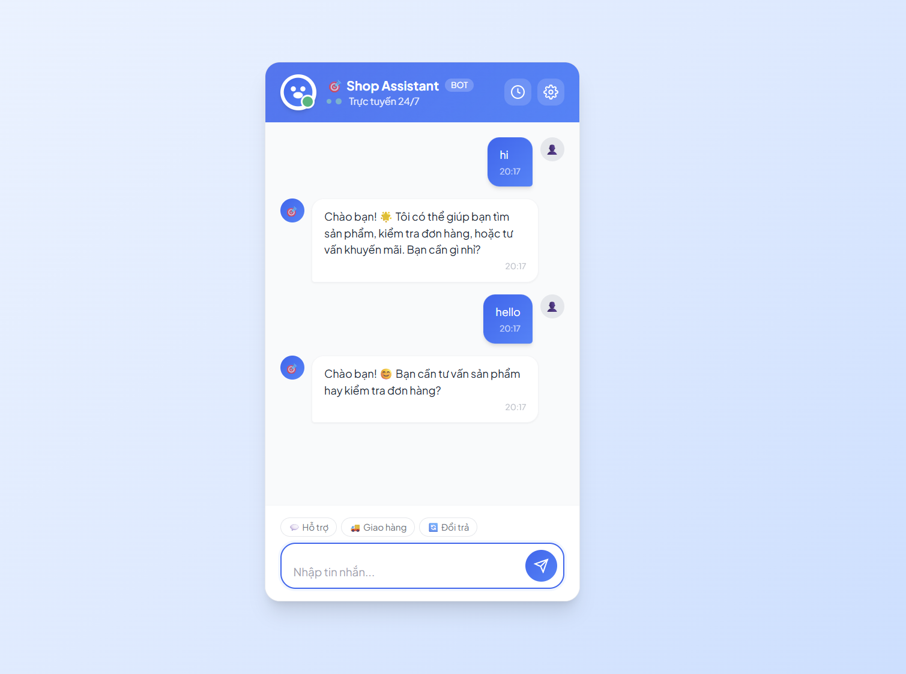
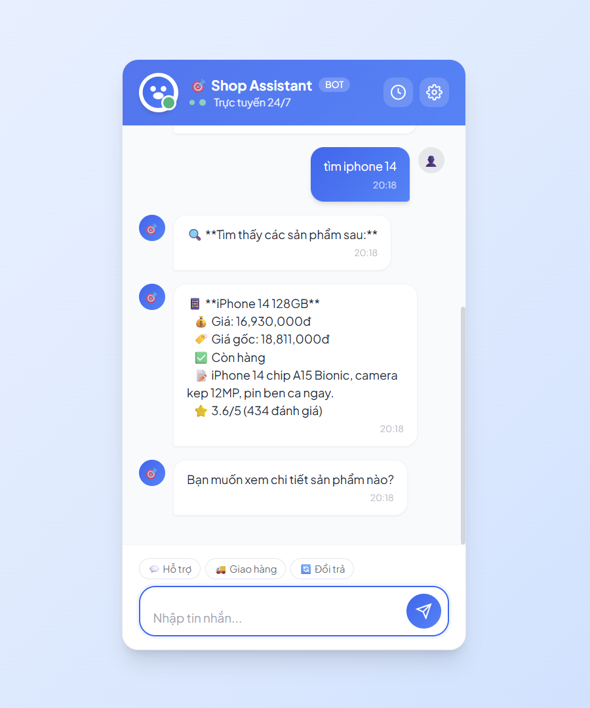
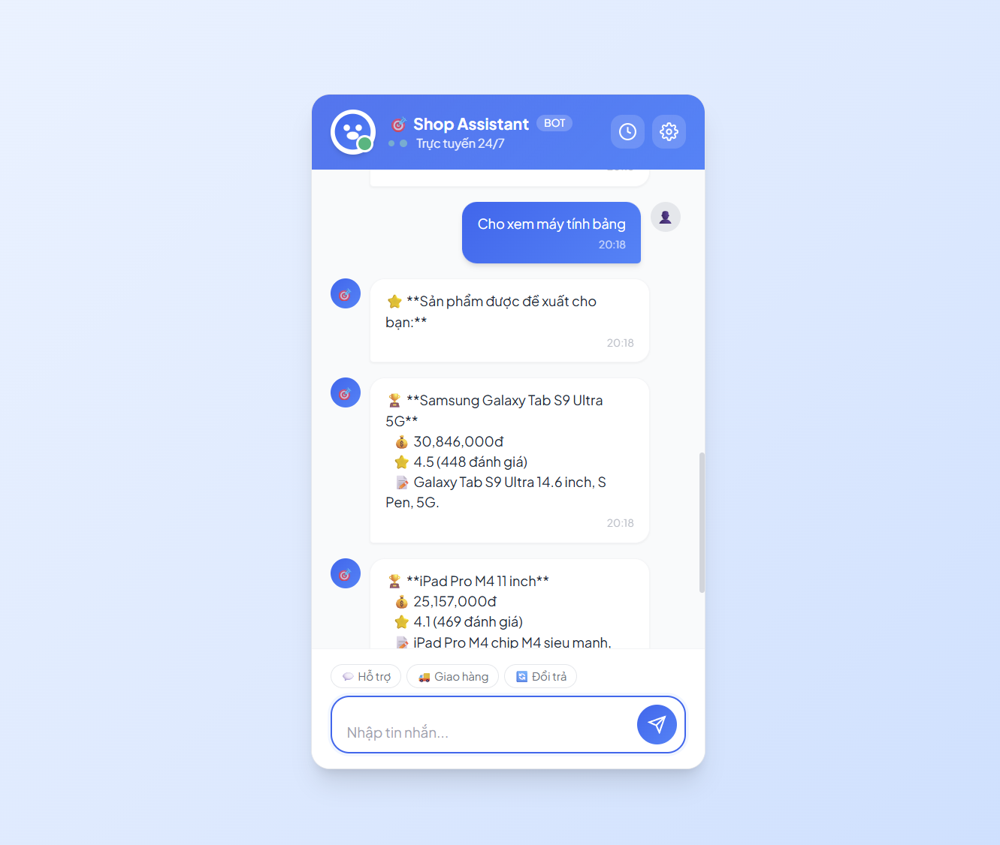
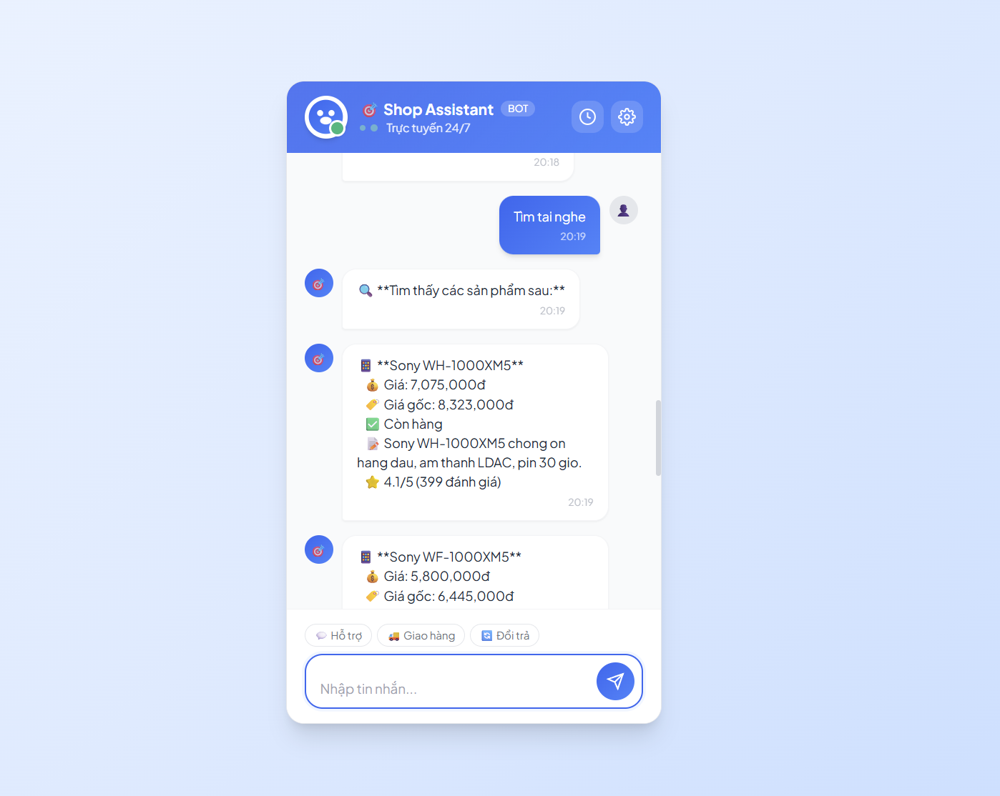
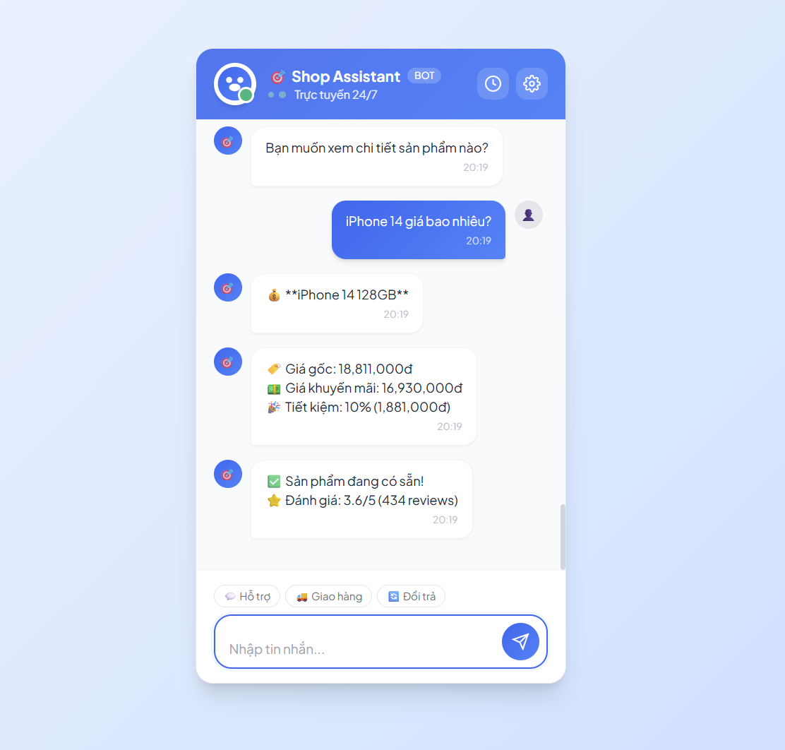
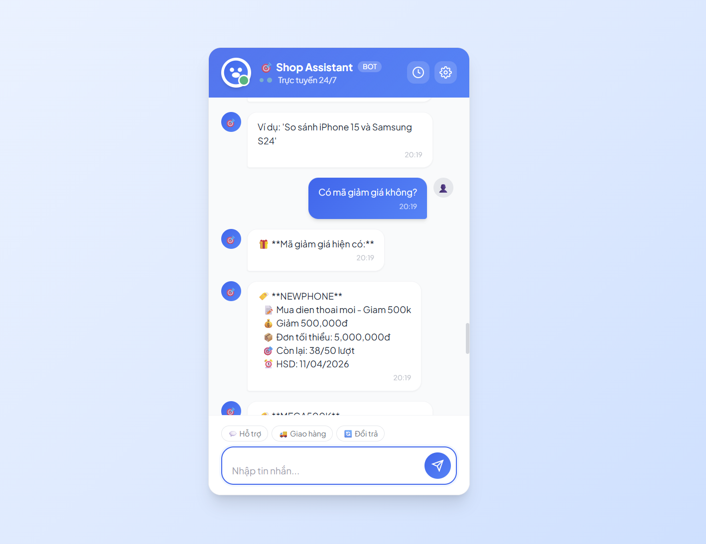
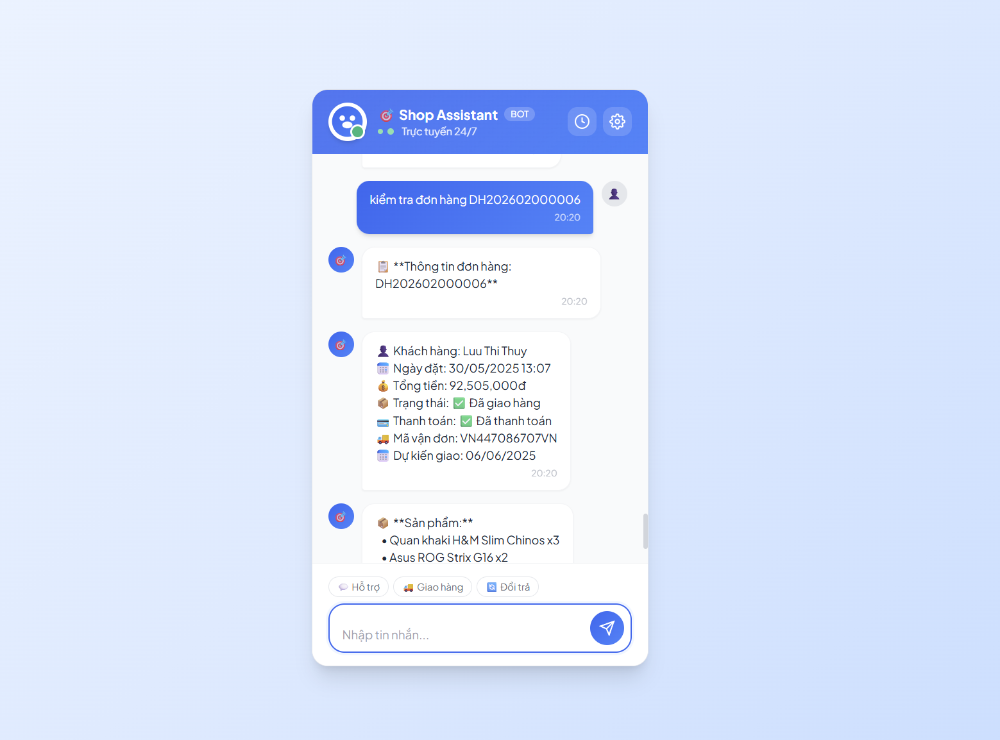
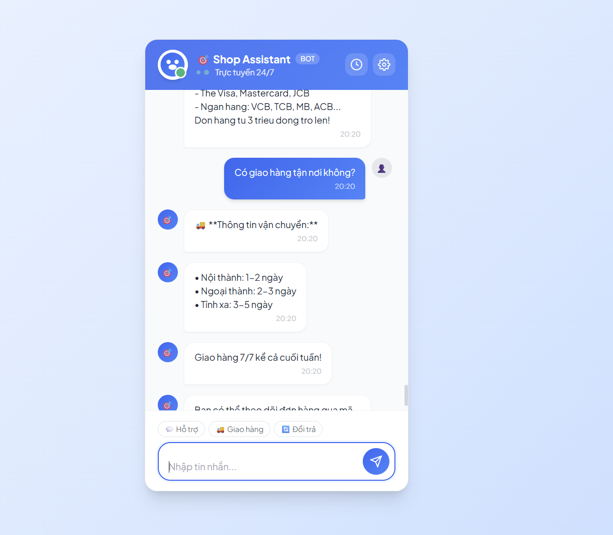
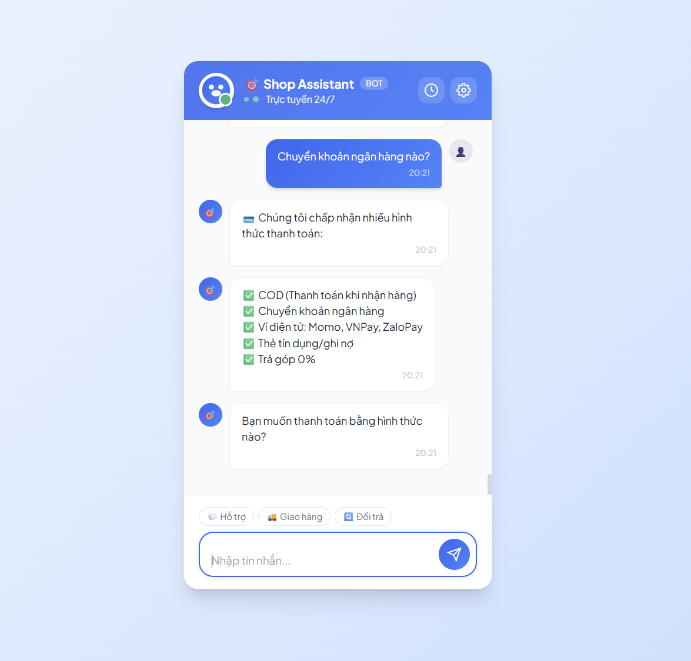
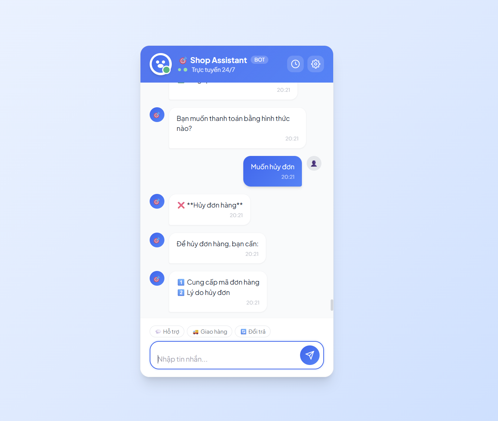

# 🤖 E-Commerce Chatbot - Trợ lý ảo thông minh cho Website bán hàng

Chatbot AI hỏi đáp thông minh được xây dựng bằng Rasa Framework, kết nối MySQL để tư vấn sản phẩm, kiểm tra đơn hàng và hỗ trợ khách hàng 24/7.

## 🌟 Tính năng chính

### 📦 Quản lý sản phẩm
- ✅ Tìm kiếm sản phẩm theo tên, loại, thương hiệu
- ✅ Kiểm tra giá và khuyến mãi
- ✅ Kiểm tra tồn kho theo biến thể
- ✅ Xem thông số kỹ thuật chi tiết
- ✅ So sánh sản phẩm
- ✅ Gợi ý sản phẩm phù hợp

### 🛒 Quản lý đơn hàng
- ✅ Kiểm tra trạng thái đơn hàng
- ✅ Theo dõi vận chuyển
- ✅ Hỗ trợ hủy đơn hàng
- ✅ Xử lý đổi trả/hoàn tiền

### 💰 Khuyến mãi & Thanh toán
- ✅ Hiển thị mã giảm giá hiện có
- ✅ Thông tin khuyến mãi hot
- ✅ Hướng dẫn thanh toán
- ✅ Thông tin phí vận chuyển

### 👤 Tài khoản & Tích điểm
- ✅ Kiểm tra thông tin tài khoản
- ✅ Xem điểm tích lũy
- ✅ Chính sách thành viên

### 📋 Chính sách
- ✅ Chính sách bảo hành
- ✅ Chính sách đổi trả
- ✅ FAQ sản phẩm

## 🛠️ Công nghệ sử dụng

- **Rasa 3.6.0** - Framework chatbot AI
- **MySQL** - Cơ sở dữ liệu
- **Python 3.8+** - Ngôn ngữ lập trình
- **Rasa SDK** - Custom actions
- **Socket.IO** - Real-time communication

## 📋 Yêu cầu hệ thống

- Python 3.8 trở lên
- MySQL 5.7 trở lên
- RAM: 4GB trở lên (khuyến nghị 8GB)
- Disk: 2GB trống

## 🚀 Cài đặt

### 1. Clone hoặc tải project

```bash
cd my_rasa_bot
```

### 2. Tạo môi trường ảo (khuyến nghị)

```bash
python -m venv venv

# Windows
venv\Scripts\activate

# Linux/Mac
source venv/bin/activate
```

### 3. Cài đặt dependencies

```bash
pip install -r requirements.txt
```

### 4. Cấu hình database

Tạo file `.env` từ `.env.example`:

```bash
copy .env.example .env
```

Chỉnh sửa file `.env` với thông tin database của bạn:

```env
DB_HOST=localhost
DB_PORT=3306
DB_NAME=ecommerce_chatbot
DB_USER=root
DB_PASSWORD=your_password
```

### 5. Khởi tạo database

```bash
# Tạo database và schema
python database/db_config.py
```

Script này sẽ:
- Tạo database `ecommerce_chatbot`
- Tạo tất cả các bảng cần thiết
- Load dữ liệu mẫu (sản phẩm, mã giảm giá, câu hỏi FAQ...)

### 6. Train model

```bash
rasa train
```

Quá trình train có thể mất 5-10 phút tùy vào cấu hình máy.

## ▶️ Chạy chatbot

### Cách 1: Chạy trong terminal (test nhanh)

```bash
rasa shell
```

### Cách 2: Chạy với action server (đầy đủ tính năng)

Mở 2 terminal:

**Terminal 1 - Action Server:**
```bash
rasa run actions
```

**Terminal 2 - Rasa Server:**
```bash
rasa run --enable-api --cors "*"
```

### Cách 3: Chạy với web interface

```bash
# Terminal 1
rasa run actions

# Terminal 2
rasa run --enable-api --cors "*" --credentials credentials.yml

# Mở file rasa-webchat/index.html trong trình duyệt
```

## 💬 Ví dụ câu hỏi

### Demo Giao diện Chat

| Chức năng | Ảnh minh họa |
|-----------|--------------|
| Chào hỏi |  |
| Tìm kiếm sản phẩm |  |
| Kiểm tra giá |  |
| Tồn kho |  |
| Khuyến mãi |  |
| Trạng thái đơn hàng |  |
| Theo dõi vận chuyển |  |
| Vận chuyển |  |
| Thanh toán |  |
| Chính sách |  |

Xem thêm nhiều kịch bản chat tại: [CHAT_DEMO.md](./CHAT_DEMO.md)

---

### Tìm kiếm sản phẩm
```
- Tìm điện thoại iPhone
- Có laptop Dell không?
- Cho xem tai nghe AirPods
- Tìm sản phẩm Apple
```

### Hỏi giá
```
- iPhone 15 giá bao nhiêu?
- Giá MacBook Pro M3
- Samsung S24 giá bao nhiêu?
```

### Kiểm tra tồn kho
```
- iPhone 15 còn hàng không?
- Còn màu đen không?
- Kiểm tra tồn kho MacBook
```

### Đơn hàng
```
- Kiểm tra đơn hàng DH123456
- Đơn hàng của tôi đến đâu rồi?
- Tôi muốn hủy đơn hàng
```

### Khuyến mãi
```
- Có mã giảm giá không?
- Khuyến mãi gì hiện tại?
- Có miễn phí ship không?
```

## 📁 Cấu trúc thư mục

```
my_rasa_bot/
├── actions/                    # Custom actions
│   ├── __init__.py
│   └── actions.py             # Tất cả actions cho e-commerce
├── data/                      # Training data
│   ├── nlu.yml               # NLU training examples
│   ├── stories.yml           # Conversation flows
│   └── rules.yml             # Rules
├── database/                  # Database files
│   ├── schema.sql            # Database schema
│   ├── sample_data.sql       # Sample data
│   └── db_config.py          # Database connection
├── models/                    # Trained models
├── rasa-webchat/             # Web interface
│   ├── index.html
│   └── images/
├── config.yml                # Rasa pipeline config
├── domain.yml                # Domain definition
├── endpoints.yml             # Endpoints config
├── credentials.yml           # Channel credentials
├── requirements.txt          # Python dependencies
├── .env.example             # Environment variables template
└── README.md                # This file
```

## 🗄️ Database Schema

### Bảng chính:
- **products** - Sản phẩm
- **product_variants** - Biến thể sản phẩm (màu sắc, dung lượng...)
- **product_categories** - Danh mục sản phẩm
- **product_faqs** - Câu hỏi thường gặp
- **orders** - Đơn hàng
- **order_items** - Chi tiết đơn hàng
- **coupons** - Mã giảm giá
- **users** - Người dùng
- **chatbot_conversations** - Lịch sử hội thoại
- **chatbot_messages** - Tin nhắn
- **chatbot_intents** - Ý định câu hỏi
- **chatbot_training_examples** - Mẫu câu hỏi training

## 🔧 Tùy chỉnh

### Thêm sản phẩm mới

Thêm trực tiếp vào database MySQL:

```sql
INSERT INTO products (name, slug, short_description, category_id, brand, is_active)
VALUES ('Tên sản phẩm', 'slug-san-pham', 'Mô tả ngắn', 1, 'Apple', TRUE);
```

### Thêm intent mới

1. Thêm intent vào `data/nlu.yml`
2. Thêm story vào `data/stories.yml`
3. Thêm response vào `domain.yml`
4. Tạo action trong `actions/actions.py` (nếu cần)
5. Train lại model: `rasa train`

### Thêm mã giảm giá

```sql
INSERT INTO coupons (code, name, type, value, min_order_value, start_date, end_date, is_active)
VALUES ('SALE20', 'Giảm 20%', 'percentage', 20, 500000, NOW(), '2024-12-31', TRUE);
```

## 📊 Training & Evaluation

### Train model
```bash
rasa train
```

### Test model
```bash
rasa test
```

### Interactive learning
```bash
rasa interactive
```

### Xem training data
```bash
rasa data validate
```

## 🐛 Troubleshooting

### Lỗi kết nối database
- Kiểm tra MySQL đã chạy chưa
- Kiểm tra thông tin trong file `.env`
- Kiểm tra user có quyền truy cập database

### Model không train được
- Kiểm tra Python version (cần 3.8+)
- Cài đặt lại dependencies: `pip install -r requirements.txt --force-reinstall`
- Xóa folder `models/` và train lại

### Action server không chạy
- Kiểm tra port 5055 có bị chiếm không
- Kiểm tra file `endpoints.yml` đã cấu hình đúng

### Chatbot không hiểu câu hỏi
- Thêm nhiều training examples vào `data/nlu.yml`
- Train lại model
- Kiểm tra confidence score

## 🔐 Bảo mật

- ⚠️ Không commit file `.env` lên Git
- ⚠️ Đổi password database mặc định
- ⚠️ Sử dụng HTTPS khi deploy production
- ⚠️ Giới hạn quyền truy cập database

## 📈 Tối ưu hiệu suất

### Database
- Tạo index cho các cột tìm kiếm thường xuyên
- Sử dụng connection pooling
- Cache kết quả query phổ biến

### Rasa
- Tăng `max_history` trong `config.yml` cho conversation dài
- Sử dụng `RulePolicy` cho các flow cố định
- Giảm `epochs` nếu train quá lâu

## 🚀 Deploy Production

### Docker (khuyến nghị)

Tạo file `Dockerfile`:

```dockerfile
FROM rasa/rasa:3.6.0

WORKDIR /app
COPY . /app

RUN rasa train

CMD ["rasa", "run", "--enable-api", "--cors", "*"]
```

Build và chạy:

```bash
docker build -t ecommerce-chatbot .
docker run -p 5005:5005 ecommerce-chatbot
```

### Server Linux

1. Cài đặt dependencies
2. Sử dụng `supervisor` hoặc `systemd` để chạy service
3. Cấu hình Nginx reverse proxy
4. Sử dụng SSL certificate

## 📞 Hỗ trợ

Nếu gặp vấn đề, vui lòng:
1. Kiểm tra phần Troubleshooting
2. Xem log trong terminal
3. Kiểm tra database connection

## 📝 License

MIT License - Tự do sử dụng và chỉnh sửa cho mục đích cá nhân và thương mại.

## 🎯 Roadmap

- [ ] Tích hợp payment gateway
- [ ] Thêm voice input/output
- [ ] Multi-language support
- [ ] Admin dashboard
- [ ] Analytics & reporting
- [ ] Mobile app integration
- [ ] AI recommendation engine

## 👨‍💻 Phát triển bởi

Chatbot E-commerce - Phiên bản 1.0.0

---

**Chúc bạn triển khai thành công! 🎉**
